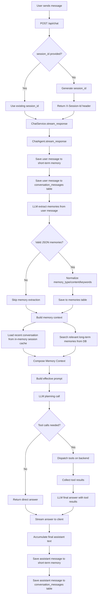

# Memory Workflow

```mermaid
flowchart TD
    A[User sends message] --> B[POST /api/chat]
    B --> C{session_id provided?}
    C -- Yes --> D[Use existing session_id]
    C -- No --> E[Generate session_id]
    E --> F[Return X-Session-Id header]
    D --> G[ChatService.stream_response]
    F --> G
    G --> H[ChatAgent.stream_response]

    H --> I[Save user message to short-term memory]
    I --> J[Save user message to conversation_messages table]

    J --> K[LLM extract memories from user message]
    K --> L{Valid JSON memories?}
    L -- No --> M[Skip memory extraction]
    L -- Yes --> N[Normalize memory_type/content/keywords]
    N --> O[Save to memories table]

    M --> P[Build memory context]
    O --> P

    P --> Q[Load recent conversation from in-memory session cache]
    P --> R[Search relevant long-term memories from DB]
    Q --> S[Compose Memory Context]
    R --> S

    S --> T[Build effective prompt]
    T --> U[LLM planning call]

    U --> V{Tool calls needed?}
    V -- No --> W[Return direct answer]
    V -- Yes --> X[Dispatch tools on backend]
    X --> Y[Collect tool results]
    Y --> Z[LLM final answer with tool results]

    W --> AA[Stream answer to client]
    Z --> AA
    AA --> AB[Accumulate final assistant text]
    AB --> AC[Save assistant message to short-term memory]
    AC --> AD[Save assistant message to conversation_messages table]
```
